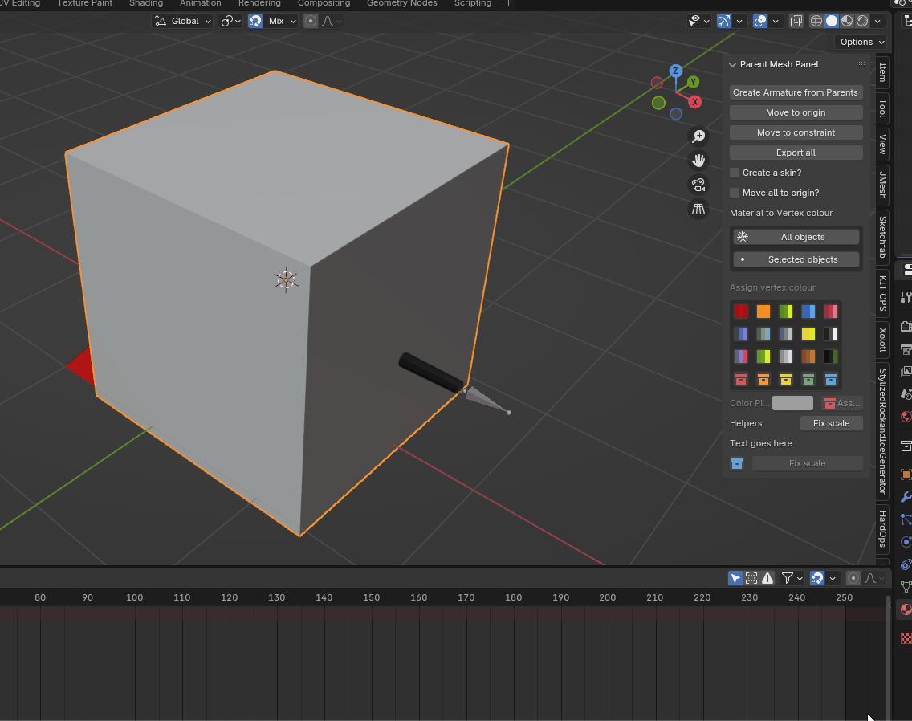
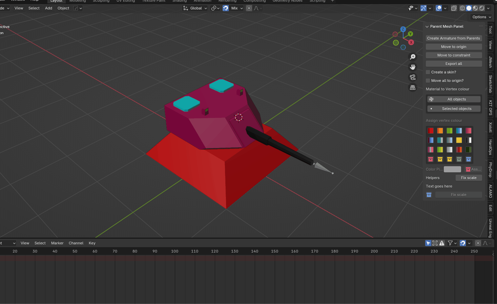
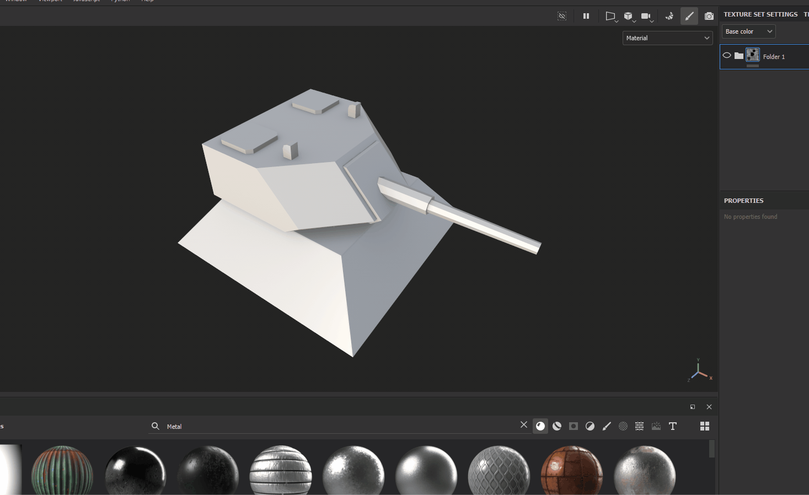
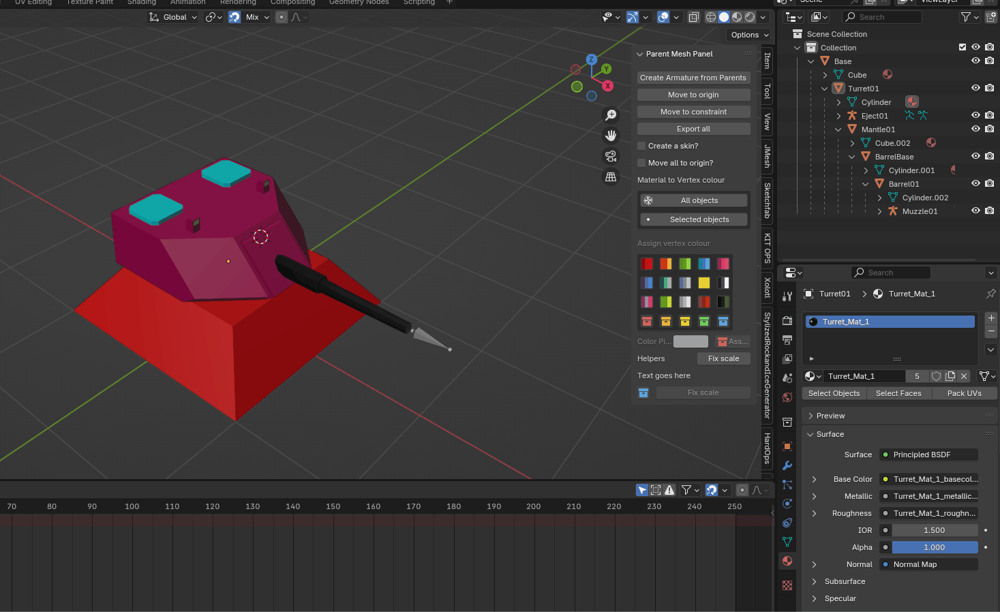
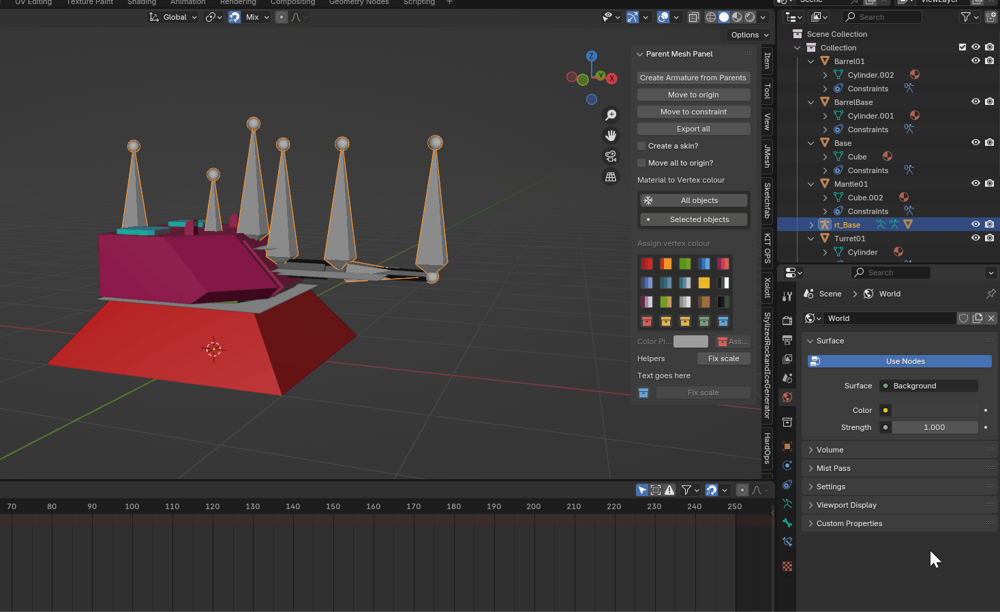

# Parented Mesh To Armature (Sean's Blender Helper)

## Why this plugin

My workflow is to model seperate objects for a part/tank/model/plane/etc..

But animation export would result in multiple animations on the export...

But if it was one mesh with an armature, then it's fine

But having to apply the vertex groups for every single mesh object was a slow and boring process...

Now it's just a click button for the entire scene

## How to install

- Use Blender 4.2 or greater
- Download the zip from GitHub [Zip](https://github.com/aurorasean/ParentMesh-to-arm/archive/refs/heads/main.zip)
- Blender -> Edit -> Preferences -> Add-ons -> Install.
- Select the downloaded zip file

## Advanced Features

- [Paint Vertex colour for selected faces](#paint-vertex-colour-for-selected-faces)
- [Parented Meshes to Armature](#parented-meshes-to-armature)
  - [Step one](#step-one)
  - [Step two](#step-two)
  - [Step three](#step-three)
  - [Step four-sort-of](#step-four-sort-of)
- [So what Do I do with the exports??](#so-what-do-i-do-with-the-exports)
- [So now I have lots of meshes, and a skeleton, what do I do with that?](#so-now-i-have-lots-of-meshes-and-a-skeleton-what-do-i-do-with-that)

### Paint Vertex colour for selected faces

> Why: Using substance painter, I can separate out polygons that I want painted one way versus the rest of the model 

> Blender usage

> Vertex colour in both Substance and Blender

> Use case for vertex paint

### Parented Meshes to Armature

> Why:
> - I create objects with relation ships, a Turret has a parent of Base, and Turret has Child of Barrel
> - But when it is imported into Unreal Engine, either it's imported as one whole mesh, or many smaller meshes
> - Nanite works on smaller Meshes, not Skins!
> - But skeletons let me keep a structure

> Solution: Create a skeleton, with the meshes, and export them
> - Unreal engine Does not like Empty Skeletons (no mesh) so have to keep a simple mesh

#### Step one

Have some meshes with parent-child relationships

> Press the button `Create Armature from parents` 

> Uncheck the checkboxes! (Todo, set them default to false for new installs)

#### Step two

Press the button `Move To Origin` 

> Unreal engine exported meshes, should be at world origin for clean imports

> Move to origin

#### Step three

Export all

The script creates reference in two new collections: 

- Meshes
- Skeletons

With Exporters set on them

Pressing the `Export all` button will export the two gITF files next to the .Blend file

#### Step four-sort-of

If you want to do animations to the model, now is the time, not before (moving Animation curves in blender is hard)

And you now need to see what the mesh looks while animating

Press `Move to constraint` to move the meshes to the relavant bone

Then animation the Skeleton

### So what Do I do with the exports??

Okay, so now you have two files, 
- `<blender-filename>-mesh.glb`
- `<blender-filename>-skel.glb`

Drag the files into unreal engine, an import landing folder

> Move to origin, Export all, drag to unreal

### So now I have lots of meshes, and a skeleton, what do I do with that?

Refer to this repo, for Unreal code that can help

[Mesh Assembler](https://github.com/aurorasean/Mesh-Assembler)

### Notes

See the example/* blend files for the model used for videos

